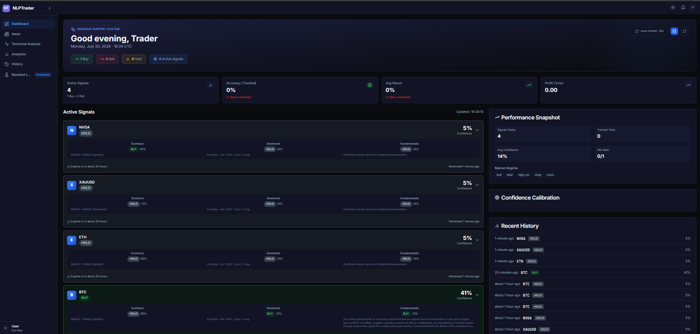
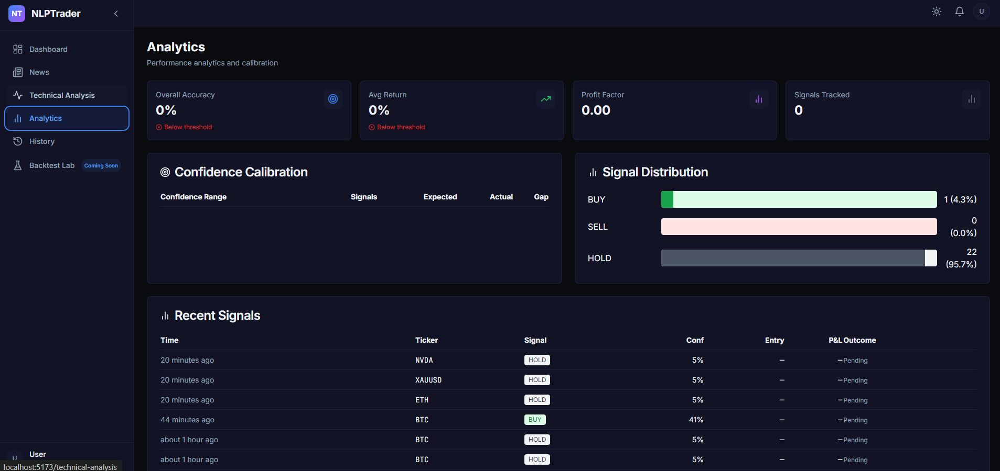
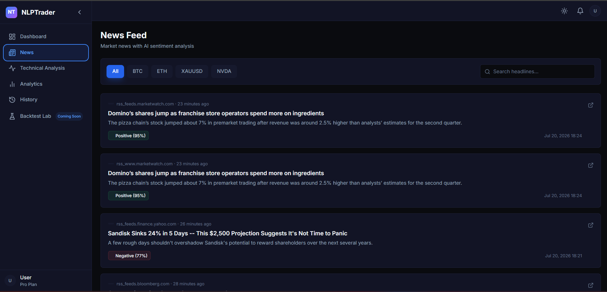

# NLPTrader

**Decision Support / Trade Intelligence System**

A production-grade signal generation platform that combines technical analysis, NLP sentiment (FinBERT), and RAG-augmented fundamental analysis (LLM) into an ensemble trading signal. Built with FastAPI, PostgreSQL (pgvector), and React.

---

## Architecture

```
┌──────────────┐     ┌──────────────┐     ┌──────────────┐
│  NEWS SOURCES│────▶│  INGESTION   │────▶│  POSTGRESQL  │
│ Finnhub / RSS│     │  Pipeline    │     │  + pgvector  │
└──────────────┘     └──────────────┘     └──────────────┘
                           │                      │
                    ┌──────┴──────┐        ┌──────┴──────┐
                    │  FinBERT    │        │  Embeddings  │
                    │  Scoring    │        │  (all-MiniLM)│
                    └──────┬──────┘        └──────┬──────┘
                           │                      │
                    ┌──────┴──────────────────────┴──────┐
                    │           SIGNAL GENERATOR         │
                    │  ┌─────────┐ ┌────────┐ ┌────────┐ │
                    │  │   TA    │ │Sentim. │ │Fundam. │ │
                    │  │ Engine  │ │ Engine │ │ Engine  │ │
                    │  └────┬────┘ └───┬────┘ └───┬────┘ │
                    │       └──────────┼───────────┘      │
                    │              ┌───┴───┐              │
                    │              │COMBINER│             │
                    │              └───┬───┘              │
                    └──────────────────┼──────────────────┘
                                       │
                              ┌────────┴────────┐
                              │   COMBINED       │
                              │   SIGNAL         │
                              │ (buy/sell/hold   │
                              │  + confidence    │
                              │  + reasoning)     │
                              └─────────────────┘
```

### Signal Pipeline

| Stage | Component | Method |
|-------|-----------|--------|
| 1 | Price Fetch | yfinance (daily OHLCV) |
| 2 | Technical Analysis | NumPy/Pandas: RSI, MACD, SMA/EMA, Bollinger Bands, ATR, Support/Resistance |
| 3 | Sentiment Analysis | FinBERT per-article → recency-weighted aggregation (48h half-life) |
| 4 | Fundamental Analysis | pgvector similarity search → LLM synthesis (narrative, themes, risks) |
| 5 | Ensemble Combiner | Vote weighting + conflict penalty + regime adjustment |

---

## Quick Start

### Prerequisites

- Docker & Docker Compose
- Python 3.11+
- Node.js 18+
- API keys: [Finnhub](https://finnhub.io/register), [Groq](https://console.groq.com)

### Setup

```bash
# 1. Start PostgreSQL with pgvector
docker compose up -d

# 2. Backend
cd backend
python -m venv .venv
.venv\Scripts\activate      # Windows
# source .venv/bin/activate # macOS/Linux
pip install -r requirements.txt
cp ../.env.example .env     # Fill in your API keys

# 3. Run database migrations
alembic upgrade head

# 4. Start the API server
python start_server.py --reload
# API docs at http://localhost:8000/docs

# 5. Frontend (separate terminal)
cd frontend
npm install
npm run dev
# Dashboard at http://localhost:5173
```

### First Run

```bash
# Ingest news + price data + generate signals in one step
curl -X POST http://localhost:8000/api/signals/refresh
```

This runs the full pipeline:
1. **News ingestion** — fetches articles from Finnhub and RSS, scores with FinBERT, embeds for vector search
2. **Price ingestion** — downloads 6 months of daily OHLCV from yfinance for all tracked tickers
3. **Signal generation** — runs TA + Sentiment + Fundamental engines, combines, and persists

---

## Screenshots

| Dashboard | Analytics |
|---|---|
|  |  |

| News Feed | Technical Analysis |
|---|---|
|  |  |

---

## Configuration (`.env`)

| Variable | Required | Default | Description |
|----------|----------|---------|-------------|
| `FINNHUB_API_KEY` | Yes | — | News source |
| `LLM_API_KEY` | Yes | — | Groq API key (OpenAI-compatible) |
| `GEMINI_API_KEY` | No | — | Fallback LLM |
| `TICKERS` | No | `BTC,ETH,XAUUSD,NVDA` | Tracked symbols |
| `POSTGRES_USER` | No | `postgres` | Database user |
| `POSTGRES_PASSWORD` | No | `postgres` | Database password |
| `POSTGRES_HOST` | No | `localhost` | Database host |
| `POSTGRES_DB` | No | `nlptrader` | Database name |

---

## API Endpoints

| Method | Path | Description |
|--------|------|-------------|
| GET | `/api/health` | System health |
| GET | `/api/health/db` | Database connectivity |
| GET | `/api/health/llm` | LLM availability |
| GET | `/api/signals/active` | Current active signals |
| GET | `/api/signals/history` | Paginated signal history |
| POST | `/api/signals/refresh` | Full pipeline refresh |
| POST | `/api/signals/generate/{ticker}` | Generate signal for one ticker |
| GET | `/api/outcomes/summary` | Accuracy and performance stats |
| POST | `/api/backtest/run` | Run walk-forward backtest |
| GET | `/api/backtest/runs` | List backtest runs |
| GET | `/api/backtest/runs/{id}` | Backtest results with equity curve |
| GET | `/api/ta/{ticker}` | Technical analysis for a ticker |
| GET | `/api/news/articles` | Paginated news articles |
| POST | `/api/news/analyze-sentiment` | Trigger sentiment analysis |
| GET | `/api/tickers/search` | Search ticker symbols |
| POST | `/api/tickers/{ticker}/track` | Add ticker to watchlist |

---

## Project Structure

```
NLPTrader/
├── backend/
│   ├── app/
│   │   ├── api/routes/       # FastAPI endpoint definitions
│   │   ├── core/             # Pydantic settings, config
│   │   ├── db/               # SQLAlchemy models + repositories
│   │   ├── ingestion/        # Finnhub/RSS adapters, pipeline, dedup
│   │   ├── signals/          # TA, Sentiment, Fundamental, Combiner, Generator
│   │   ├── evaluation/       # Backtest engine + outcome tracker
│   │   ├── llm/              # Groq/Gemini LLM client
│   │   └── main.py           # FastAPI application entry point
│   ├── tests/                # Unit tests
│   └── requirements.txt
├── frontend/                 # React 18 + TypeScript + Vite
│   └── src/
│       ├── api/              # API client + TypeScript interfaces
│       ├── components/       # Reusable UI components
│       ├── pages/            # Dashboard, History, Backtest, Analytics, News
│       └── theme/            # Dark/light mode provider
├── alembic/                  # Database migrations
├── docker-compose.yml        # PostgreSQL + pgvector
├── .env.example              # Environment template
└── README.md
```

---

## Tech Stack

| Layer | Technology |
|-------|-----------|
| **API** | FastAPI (Python 3.11+) |
| **Database** | PostgreSQL 16 + pgvector |
| **ORM** | SQLAlchemy 2.0 (async) |
| **LLM** | Groq (Llama-3.3-70B) / Gemini fallback |
| **NLP** | FinBERT (ProsusAI) + Sentence-Transformers |
| **Frontend** | React 18, TypeScript, Vite, TanStack Query |
| **Charts** | lightweight-charts (TradingView) |
| **Price Data** | yfinance |
| **News Data** | Finnhub, RSS feeds |
| **Infrastructure** | Docker Compose |

---

## Design Decisions

| Decision | Rationale |
|----------|-----------|
| PostgreSQL + pgvector | Unified relational + vector store, no extra service |
| Pure Python TA (no TA-Lib) | No C dependencies, fully testable, transparent |
| Recency-weighted sentiment | Recent news matters more (48h half-life decay) |
| RAG fundamental analysis | Retrieval-augmented LLM grounded in actual news |
| Walk-forward backtest | Zero lookahead — only data available at each timestamp |
| Model versioning in DB | Full reproducibility for every signal |
| Conflict penalty in combiner | Conflicting buy+sell votes reduce confidence |
| 30-second frontend polling | Balance between freshness and API load |

---

## License

MIT — For research and educational use. Not financial advice.
